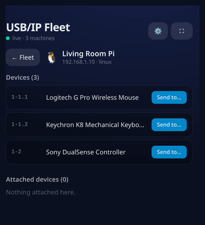
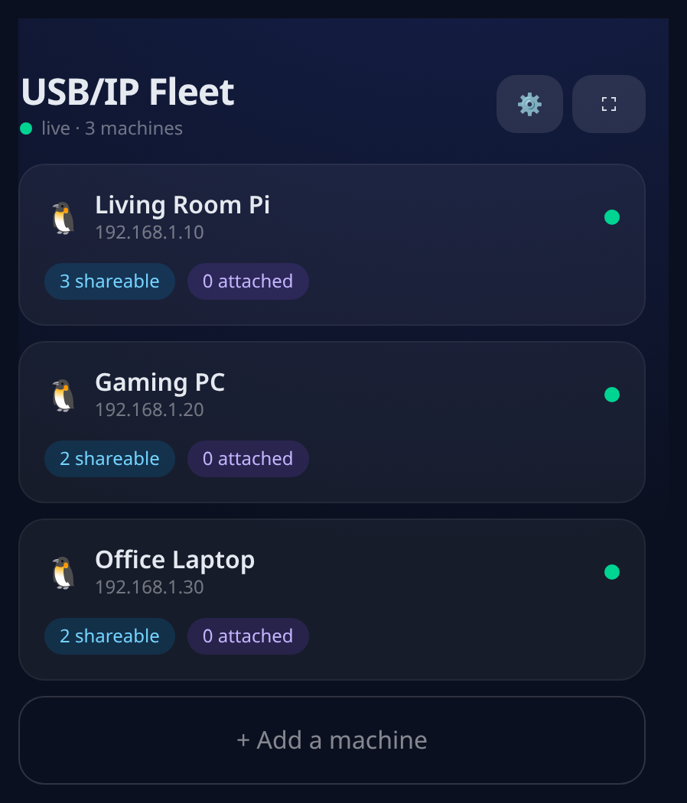
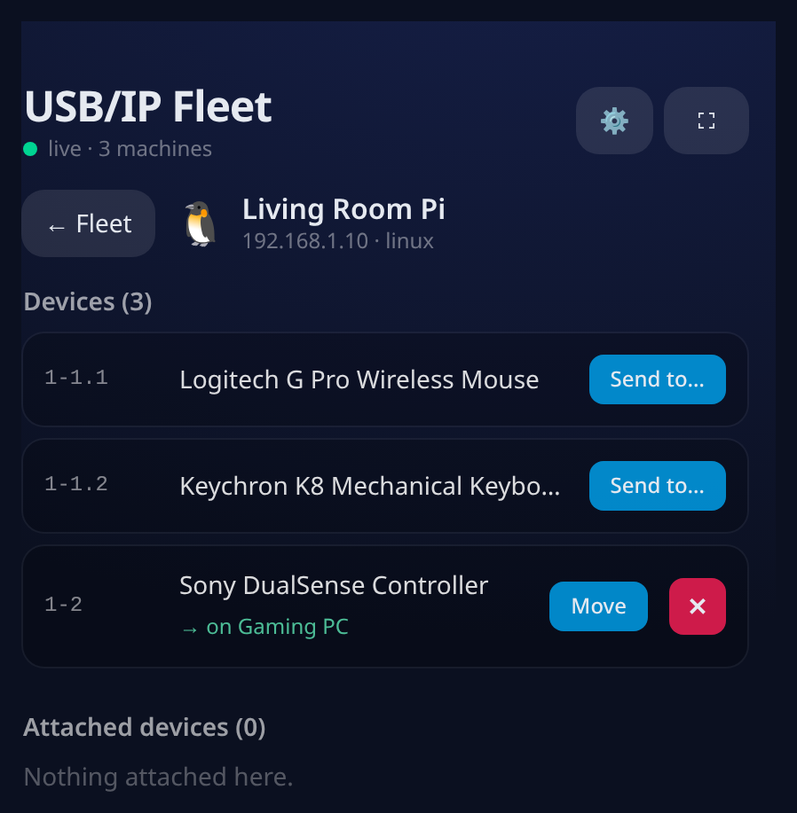
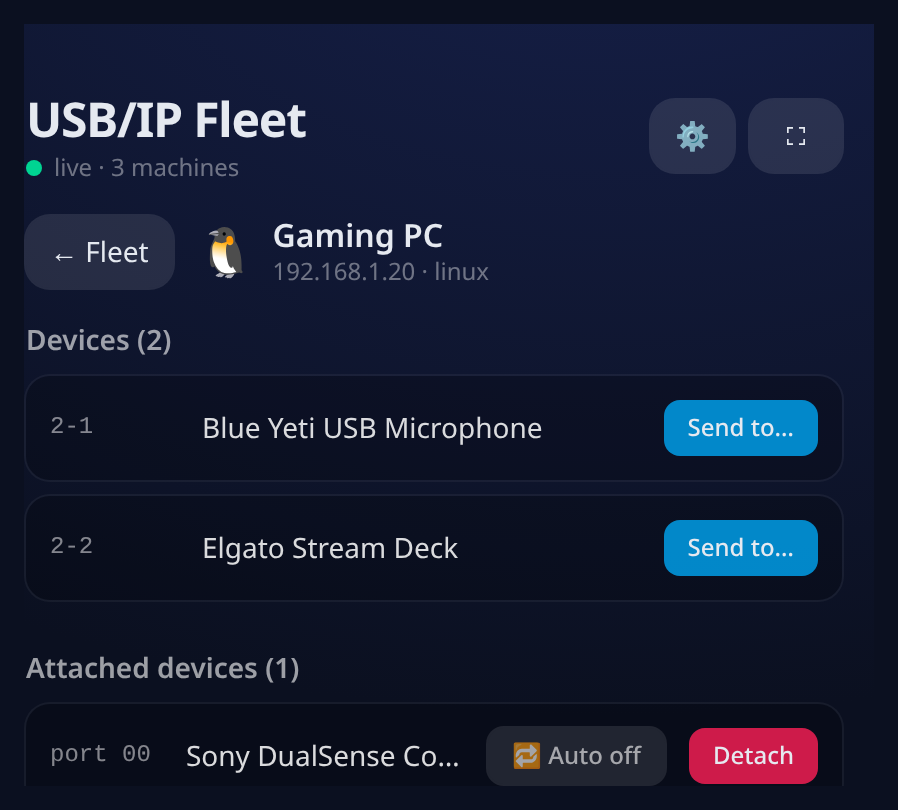
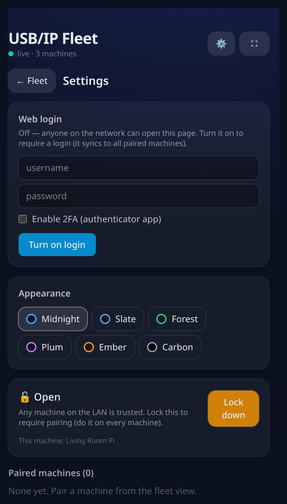
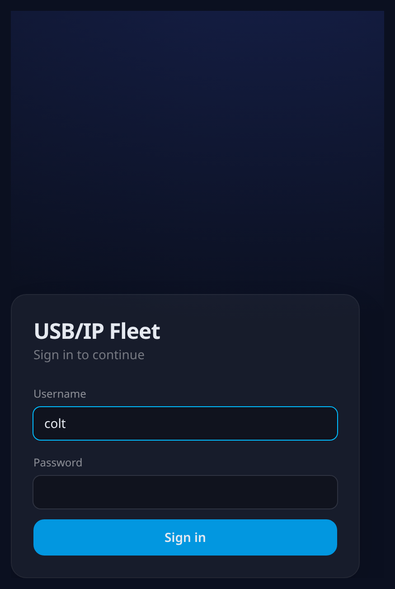

# 🔌 USB/IP Fleet

Share USB devices across every machine in your home from your phone. Plug a controller into the
Raspberry Pi in the living room, open a web page on your phone, and **send it to your gaming PC** —
it just shows up there. Detach it and it's free again.

Each machine runs one small service that is agent + hub + web server all in one. Point any phone or
browser on your LAN at any machine and you see the **whole fleet** — no app to install, no cloud.

<p align="center">
  
</p>

> **Rewrite note:** This is a ground-up rewrite (v3) of the original PyQt desktop app. The old
> desktop version lives in the `v2.4.4` git tag if you need it.

## ✨ Features

- 🖥️ **Whole-fleet view** — every machine on your LAN, auto-discovered over mDNS. No IPs to type.
- 📲 **Phone-first web UI** — plain responsive website served on your LAN. "Add to home screen" +
  a fullscreen button. Nothing to install.
- 🔀 **Any‑PC → any‑PC** — pick a device on one machine, send it to another. Move it between
  machines with an in‑app confirm.
- 🔁 **Auto‑reconnect** — arm a device and its machine re‑grabs it after a reboot, replug, or blip.
- 🔒 **Pairing (Syncthing‑style)** — machines must be approved before they can share, on by default.
- 👤 **Shared web login + 2FA** — set a username/password once; it syncs to every paired machine.
  Optional TOTP authenticator (with a QR code).
- 🎨 **Themes** — six looks, and live/offline machine notifications.
- 🐧 **Linux + Raspberry Pi** first‑class. Windows support is included but still being tested.

## 📸 Screenshots

| Fleet | A machine | Attached + auto‑reconnect |
|---|---|---|
|  |  |  |

| Settings (login · themes · pairing) | Sign in |
|---|---|
|  |  |

## 🚀 Install

On **each** machine you want in the fleet (Linux / Raspberry Pi):

```bash
git clone https://github.com/cyphercolt/usbip-gui-app.git
cd usbip-gui-app
sudo packaging/install-linux.sh
```

That installs `usbip` + kernel modules, and runs the node as a **root systemd service** on
`http://<that-machine-ip>:4820` (root, so USB/IP needs no sudo password). Re‑run the same command
after `git pull` to update.

Then open `http://<any-machine-ip>:4820` on your phone. Machines discover each other automatically;
approve each pairing once (they start **locked**).

<sub>The prebuilt web UI ships in the repo, so the target machines don't need Node.js.</sub>

## 🎮 Using it

1. **Plug a device** into any machine (say the Pi).
2. On the fleet page, tap that machine → find the device → **Send to…** → pick a destination.
3. On the destination it appears under **Attached devices**; toggle **🔁 Auto** to keep it there.
4. **Detach** (or the ✕ on the source) frees the device — it works locally again and can be sent
   elsewhere.

## 🧭 Architecture

```
   Phone / browser ──http──▶  ANY node's IP
                                │  serves the web UI + REST/WebSocket API
                                │  discovers peers (mDNS), aggregates the fleet
                                │  orchestrates any‑PC → any‑PC attach
             ┌──────────────────┼───────────────────┐
        pairing token      pairing token       pairing token
             ▼                  ▼                    ▼
        NODE (Pi)         NODE (gaming PC)      NODE (laptop)
      usbip locally       usbip locally         usbip locally
```

- **Backend** — Python + FastAPI + `zeroconf`; one symmetric service per machine (`node/`).
- **Frontend** — React + TypeScript + Vite + Tailwind, built to static files the node serves (`web/`).
- **Transport** — plain HTTP on the LAN. Node‑to‑node calls are authenticated by each node's key;
  the browser is gated by the web login when you enable it.

Developer notes: [`docs/V3-DEV.md`](docs/V3-DEV.md).

## 🔐 Security

- **Pairing is on by default.** Discovered machines show as *pending* until you approve them; an
  unpaired machine can't see devices or issue commands. (Switch to *Open* in Settings for a fully
  trusted LAN.)
- **Web login** (optional) gates the UI so nobody on the LAN can drive USB without the credential.
  Set it once — it syncs to every paired machine — and turn on **TOTP 2FA** if you want.

## 🪟 Windows (experimental)

Needs [`usbipd-win`](https://github.com/dorssel/usbipd-win) (`winget install usbipd`) to share and
[`usbip-win2`](https://github.com/vadimgrn/usbip-win2) to attach. Then, in an elevated PowerShell:

```powershell
Set-ExecutionPolicy -Scope Process Bypass -Force
.\packaging\install-windows.ps1
```

The code is ported from the old app's working commands but hasn't been verified on current hardware
yet — please file an issue with your `usbipd list` output if something's off.

## 🛠️ Development

```bash
scripts/dev-node.sh          # backend :4820 + hot‑reloading UI :5173
# demo mode with fake devices (no hardware):
USBIP_NODE_DEMO=1 USBIP_NODE_DEMO_DEVICES=1-1.1,1-1.2 python -m usbip_node
cd node && pytest -q         # backend tests
```

## 📜 License

MIT — see [LICENSE](LICENSE).
